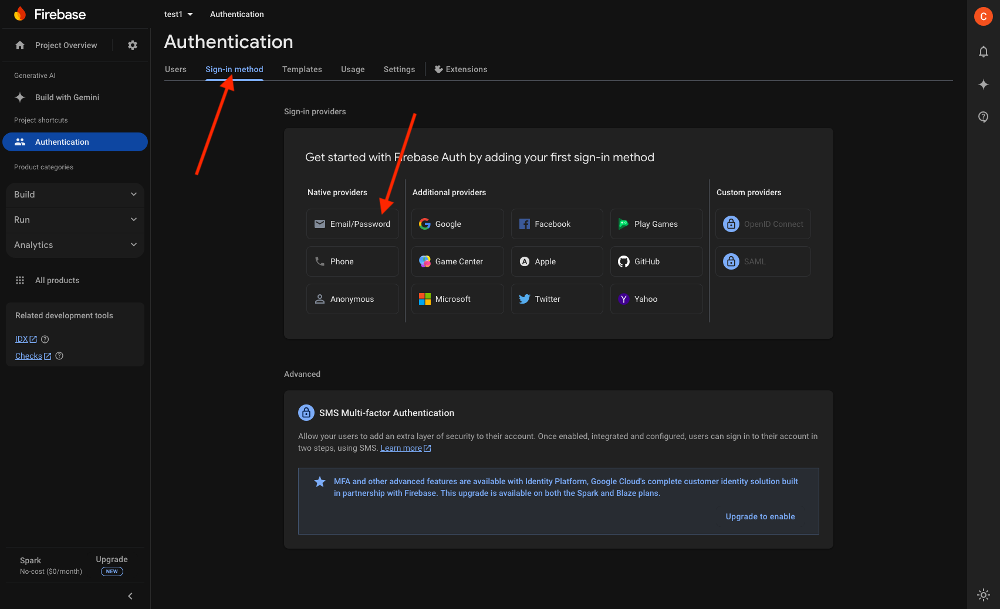
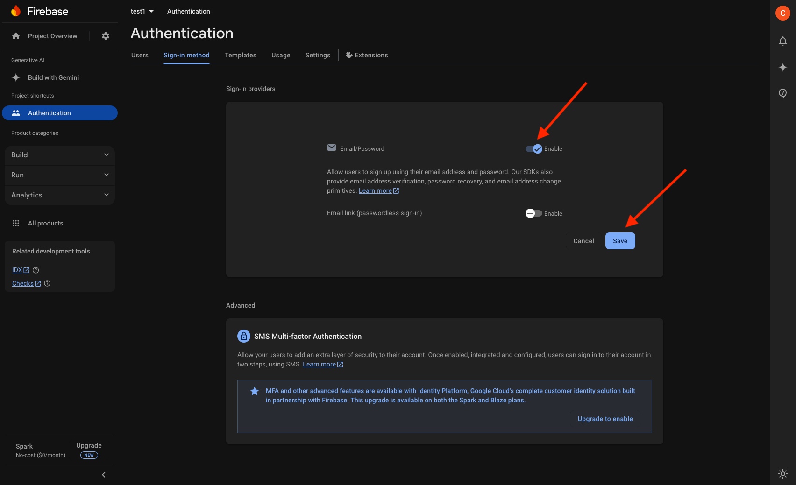
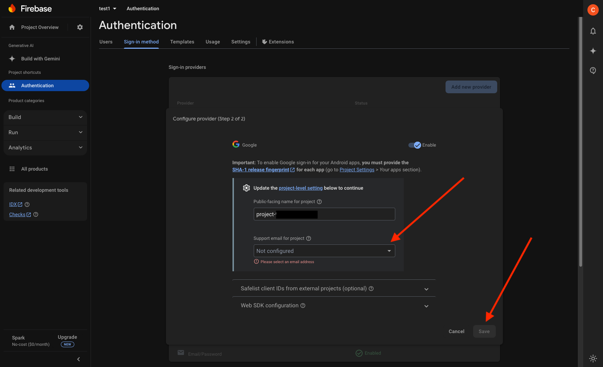
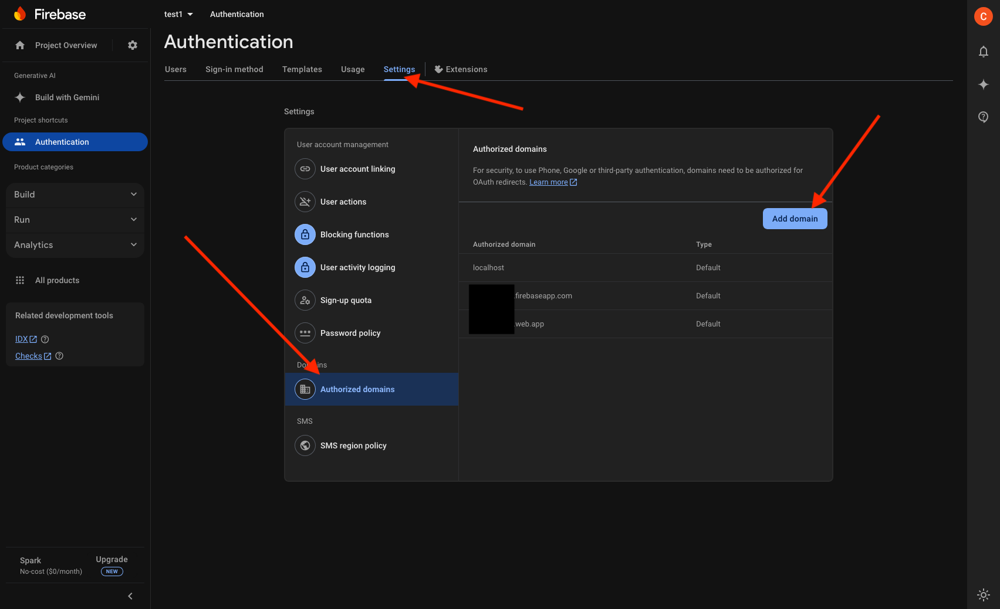
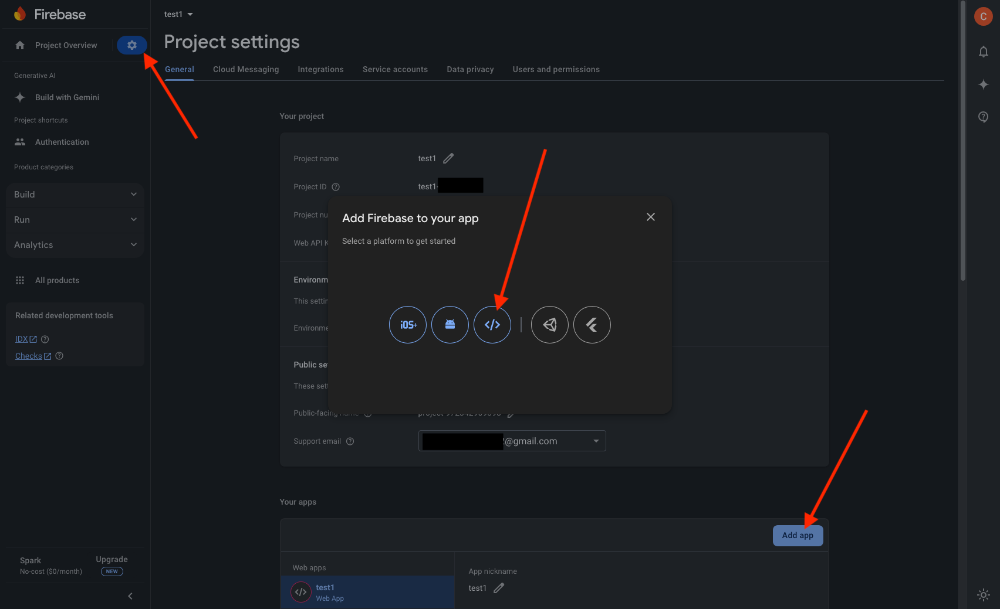
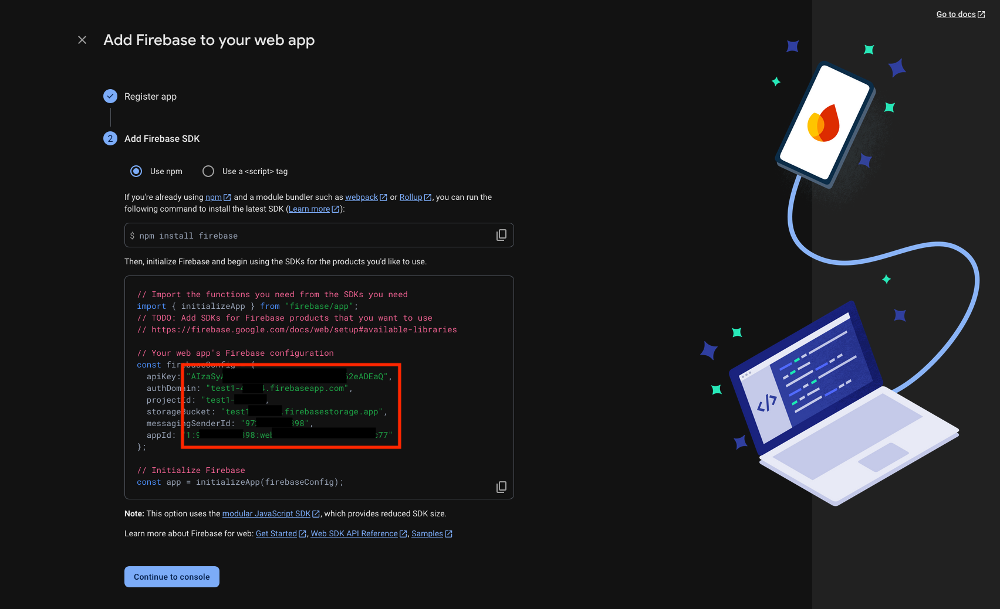
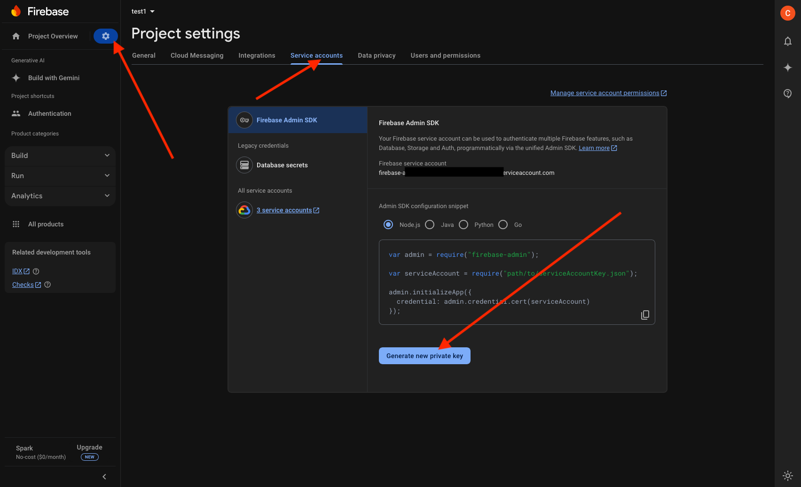
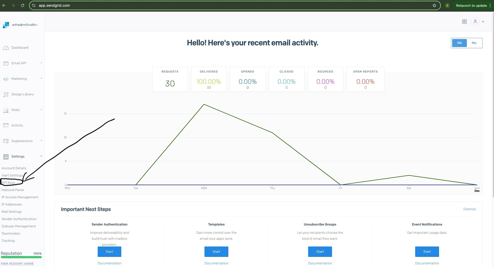
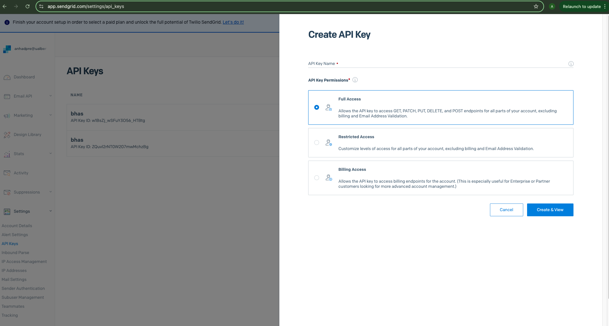
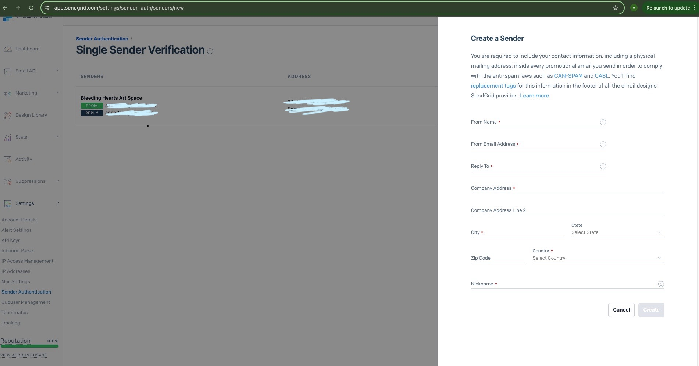

# Deployment Instructions

# System Requirements

* Ubuntu Server 20.04 LTS or newer  
* Minimum 4GB RAM  
* 20GB available disk space

The deployment instructions provided in this document have been tested and verified on Ubuntu Server 20.04 LTS. However, please note:

* Other Ubuntu versions (18.04+) should work with minimal or no modifications  
* Other Linux distributions (Debian, CentOS, etc.) should also work but may require:  
    * Different package manager commands (apt → yum/dnf)  
    * Slightly different Docker installation steps  
    * Modified firewall configurations  
    * Different service management commands

These instructions are written for deployment via direct terminal access to a Linux server. The steps assume you have root/sudo access to the server and will be managing the Docker containers directly.

While these instructions focus on direct server deployment, the Docker configuration provided should also be compatible with most cloud platforms that support Docker container management. The actual deployment steps would differ based on your chosen cloud platform's interfaces and tools, but the core Docker and application configuration would remain largely the same.

# Prerequisites

## 1. Firewall Configuration

Ensure the following ports are open in your server firewall:

* Port 80 (HTTP): Required for web traffic  
* Port 443 (HTTPS): Required if using SSL  
* Port 22 (SSH): Required for server access

## 2. Firebase Authentication Setup

### Step 1: Create Firebase Project

* Visit Firebase Console ([https://console.firebase.google.com](https://console.firebase.google.com))  
* Click "Create a project" or select existing project  
* Follow the setup wizard to create your project

### Step 2: Enable Authentication

* In Firebase Console, click "Authentication"


* Click "Get Started"  
* Enable Email/Password authentication:  
    * Click "Sign-in method"  
    * Click "Email/Password"  
    * Toggle "Enable"  
    * Save




* Enable Google authentication:  
    * Click "Sign-in method"  
    * Click “Add new provider”  
    * Click "Google"  
    * Select support email  
    * Save  
    * Click “Settings” \> “Authorized Domains” \> “Add domain” and add your domain




### Step 3: Create Web App

* Click gear icon ⚙️ (Project Settings)  
* Under "Your apps", click web icon (</\>)  
* Register app with a nickname  
* Copy the provided firebaseConfig variables for the frontend environment file (described in section [Configure environment variables](#3-configure-environment-variables))




### Step 4: Get Admin SDK Credentials

* In Project Settings, go to "Service accounts"  
* Click "Generate new private key"  
* Save the JSON file securely  
* This file will be used for Firebase credentials JSON file used on your server `yourapplication/backend/firebase-credentials.json` (described in section [Configure environment variables](#3-configure-environment-variables))



## 3. SendGrid Setup

### Step 1: Create a SendGrid Account

1. Go to the [SendGrid website](https://sendgrid.com/) and sign up for an account.  
2. Verify your email address and complete the required account setup.

### Step 2: Generate an API Key

1. Log in to your SendGrid dashboard.  
2. Navigate to the **API Keys** section:  
    * Go to **Settings** \> **API Keys**.  
3. Click on **Create API Key**.  
4. Enter a name for the API key (e.g., `MyApp-SendGrid-API`).  
5. Assign **Full Access** or **Restricted Access** permissions based on your requirements.  
6. Click **Create & View** to generate the key.  
7. Copy the API key and save it securely. You won't be able to view it again.





### Step 3: Add SendGrid to Your Project

1. Install the SendGrid library for your application:  
     * For Node.js: Run the command:  

```bash
npm install @sendgrid/mail
```

2. Set up the SendGrid API key in your environment variables (described in section [Configure environment variables](#3-configure-environment-variables)):

* Add the following to your `.env` file in backend:  
        1. `SENDGRID_API_KEY`=`<your-sendgrid-api-key>`  
        2. `SENDGRID_FROM_EMAIL`=`<your-verified-sender-email>`
    * Replace `<your-sendgrid-api-key>` with your API key.  
    * Replace `<your-verified-sender-email>` with the email address you’ll use as the sender (this email must be verified in SendGrid).

### Step 4: Verify Your Sender Identity

1. In the SendGrid dashboard, navigate to **Settings** \> **Sender Authentication**.  
2. Set up either:  
    * **Single Sender Verification**:  
        * Add your email address (e.g., `example@domain.com`) and verify it.



# Initial Server Setup

## 1. Update the system packages:
```bash
sudo apt update 
sudo apt upgrade -y
```

## 2. Install Docker

#### 1. Set up Docker's `apt` repository.
```bash
# Add Docker's official GPG key:
sudo apt-get update
sudo apt-get install ca-certificates curl
sudo install -m 0755 -d /etc/apt/keyrings
sudo curl -fsSL https://download.docker.com/linux/ubuntu/gpg -o /etc/apt/keyrings/docker.asc
sudo chmod a+r /etc/apt/keyrings/docker.asc

# Add the repository to Apt sources:
echo \
  "deb [arch=$(dpkg --print-architecture) signed-by=/etc/apt/keyrings/docker.asc] https://download.docker.com/linux/ubuntu \
  $(. /etc/os-release && echo "$VERSION_CODENAME") stable" | \
  sudo tee /etc/apt/sources.list.d/docker.list > /dev/null
sudo apt-get update
```

#### 2. Install the Docker packages.
```bash
sudo apt-get install docker-ce docker-ce-cli containerd.io docker-buildx-plugin docker-compose-plugin
```

#### 3. Verify that the installation is successful by running the `hello-world` image:
```bash
sudo docker run hello-world
```

This command downloads a test image and runs it in a container. When the container runs, it prints a confirmation message and exits.

For more info: [https://docs.docker.com/engine/install/ubuntu/](https://docs.docker.com/engine/install/ubuntu/) 

# Application Deployment

## 1. Transfer application files to server:

This step is done on your local machine:

### From Linux/macOS
```bash
# From your local terminal
scp your-application.tar.gz user@your-server-ip:/home/user/
```

### From Windows
```bash
# Using PowerShell/Command Prompt with OpenSSH
scp your-application.tar.gz user@your-server-ip:/home/user/

# OR if using PuTTY's pscp
pscp your-application.tar.gz user@your-server-ip:/home/user/

# Note: If using Windows Terminal or PowerShell, you might need to specify the full path:
# C:\Users\YourUsername\path\to\your-application.tar.gz
```

## 2. On the server, extract the files:
```bash
# For .tar.gz
cd /home/user
tar -xzf your-application.tar.gz
cd your-application
```

## 3. Configure environment variables:

For both the frontend and backend applications, you'll need to set up environment variables using the provided example files as templates.

### Frontend Configuration:
```bash
# Create production environment file from example
cp frontend/.env.example frontend/.env.production.local

# Edit the environment file with your production values
nano frontend/.env.production.local
```

Example:
```bash
# Backend site
VITE_API_URL=http://example.com/api

# Firebase Config
VITE_FB_API_KEY=aBcDeFg
VITE_FB_AUTH_DOMAIN=bleeding-heart-art-space.firebaseapp.com
VITE_FB_PROJECTID=bleeding-heart-art-space
VITE_FB_STORAGEBUCKET=bleeding-heart-art-space.appspot.com
VITE_FB_MESSAGINGSENDERID=123456789
VITE_FB_APPID=1:123456789:web:1a2b3c4d5e
```

* `VITE_API_URL`: must be `http://<domain or ip>/api`  
* Copy each Firebase config variable from section [Create Web App](#step-3-create-web-app)

### Backend Configuration:
```bash
# Create production environment file from example
cp backend/.env.example backend/.env.production.local

# Edit the environment file with your production values
nano backend/.env.production.local
```

Example:
```bash
# port to run application on
PORT=80
# the lowest priority of logs that is displayed (usually `debug` for development and `warn` in production)
# log levels - error: 0, warn: 1, info: 2, http: 3, verbose: 4, debug: 5, silly: 6
LOG_LEVEL=warn
# database host name (usually `localhost` for development and `db` in production)
DB_NAME=bhas
# postgres port (default 5432 for postgres)
DB_HOST=db
# postgres database name
DB_USER=admin
# postgres username
DB_PORT=5432
# postgres password for username
DB_PASSWORD=password
# path to firebase credentials json file
GOOGLE_APPLICATION_CREDENTIALS=./firebase-credentials.json
# sendgrid email api
SENDGRID_API_KEY=SG.aBcDeFgHiJkLmNoPqRsTuVwXyZ
SENDGRID_FROM_EMAIL=info@email.com
```

The variables that should be configured are:

* `DB_USER`: any username (or keep as `admin`).  
* `DB_PASSWORD`: must be a secure password.  
* `GOOGLE_APPLICATION_CREDENTIALS`: create a new Firebase credentials JSON file described in section [Get Admin SDK Credentials](#step-4-get-admin-sdk-credentials) and copy it to the server to the location `backend/firebase-credentials.json` of the application.  
* `SENDGRID_API_KEY`: the api key obtained from section [SendGrid Setup](#3-sendgrid-setup).  
* `SENDGRID_FROM_EMAIL`: the email being used with SendGrid.

All other variables do not need modification.

## 4. Deploy with Docker Compose

From the application root directory, start docker:
```bash
sudo docker compose --env-file ./backend/.env.production.local up --build -d
```

## 5. Enable SSL (Recommended)

#### 1. Install NGINX and Certbot:
```bash
sudo apt update
sudo apt install nginx certbot python3-certbot-nginx
```

#### 2. Create/edit NGINX configuration file:
```bash
sudo nano /etc/nginx/sites-available/your-domain.conf
```

#### 3. Add basic NGINX configuration:
```bash
server {
    listen 80;
    server_name your-domain.com;

    location / {
        proxy_pass http://localhost:your_app_port;
        proxy_set_header Host $host;
        proxy_set_header X-Real-IP $remote_addr;
        proxy_set_header X-Forwarded-For $proxy_add_x_forwarded_for;
        proxy_set_header X-Forwarded-Proto $scheme;
    }
}
```

#### 4. Create symbolic link:
```bash
sudo ln -s /etc/nginx/sites-available/your-domain.conf /etc/nginx/sites-enabled/
```

#### 5. Test NGINX configuration:
```bash
sudo nginx -t
```

#### 6. If test is successful, restart NGINX:
```bash
sudo systemctl restart nginx
```

#### 7. Obtain SSL certificate:
```bash
sudo certbot --nginx -d your-domain.com
```

#### 8. Certbot will automatically modify your NGINX configuration to include SSL settings. The final configuration should look something like:
```bash
server {
    listen 80;
    server_name your-domain.com;
    return 301 https://$server_name$request_uri;
}

server {
    listen 443 ssl;
    server_name your-domain.com;

    ssl_certificate /etc/letsencrypt/live/your-domain.com/fullchain.pem;
    ssl_certificate_key /etc/letsencrypt/live/your-domain.com/privkey.pem;

    location / {
        proxy_pass http://localhost:your_app_port;
        proxy_set_header Host $host;
        proxy_set_header X-Real-IP $remote_addr;
        proxy_set_header X-Forwarded-For $proxy_add_x_forwarded_for;
        proxy_set_header X-Forwarded-Proto $scheme;
    }
}
```

Additional important steps:

#### 9. Set up auto-renewal for SSL certificate:
```bash
sudo certbot renew --dry-run
```

For detailed NGINX configuration or alternative SSL solutions, refer to:

* NGINX documentation: [https://nginx.org/en/docs/](https://nginx.org/en/docs/)  
* Let's Encrypt documentation: [https://letsencrypt.org/docs/](https://letsencrypt.org/docs/) 
