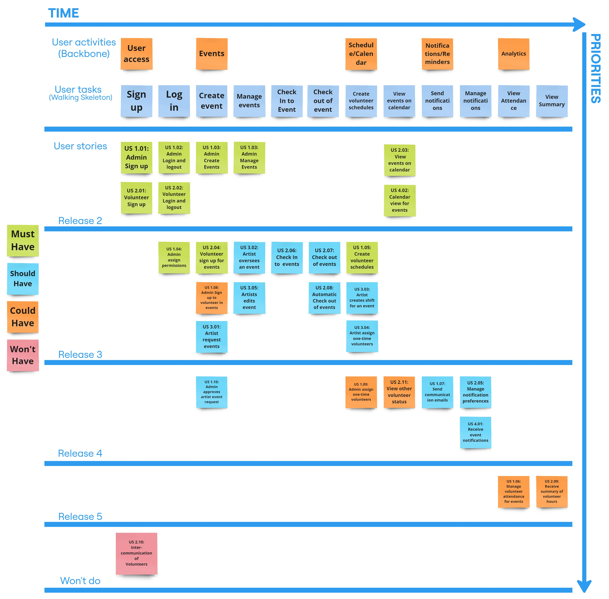

# Project Management

This page provides a general overview of the assigned tasks and roles for the duration of five sprints (subject to change).

## Story Map

## Project Plan

### **Sprint 1**

*Due: September 30, 2024*

#### **Tasks**

| Task                        | Related US    | Assigned To         | Due Date |
| ---------------------------- | ------------- | ------------------- | -------- |
| User Stories, MoSCow, Story Points | Documentation  | Samuel Chan         | Sep 17   |
| UML Diagram                  | Documentation  | Amaan Mohammed       | Sep 27   |
| Sequence Diagram             | Documentation  | Rishit Gajjar        | Sep 27   |
| Architecture Diagram         | Documentation  | Chase Johnson        | Sep 27   |
| Low-Fidelity UI Flow         | Documentation  | Anhadpreet Singh     | Sep 27   |
| Story Map & Project Plan      | Documentation  | Rushabh Shah         | Sep 27   |
| Team Canvas                  | Documentation  | Everyone             | Sep 28   |

### **Sprint 2**

*Due: October 14, 2024*

#### **User stories**

| User story                            | Story points |
| ------------------------------------- | ------------ |
| SETUP - Setting up the dev environment | 3            |
| US 1.01 - Admin Sign Up               | 3            |
| US 1.02 - Admin Log In                | 3            |
| US 1.03 - Create and manage events    | 8            |
| US 2.01 - Volunteer Sign Up           | 3            |
| US 2.02 - Volunteer Log In            | 3            |
| US 2.03 - View events on calendar     | 8            |
| US 4.02 - View calendar               | 8            |

Estimated Sprint Velocity: **39**

#### **Tasks**

| Task                                     | Related US                               | Assigned To                      | Due Date |
| ---------------------------------------- | ---------------------------------------- | --------------------------------- | -------- |
| PostgreSQL database Setup                | SETUP                                    | Chase Johnson, Rishit Gajjar      | Oct 4    |
| User authentication                      | US 1.01, US 1.02, US 2.01, US 2.02       | Chase Johnson, Rishit Gajjar      | Oct 8    |
| Create viewable calendar and show events | US 2.03, US 4.02                         | Samuel Chan, Amaan Mohammed       | Oct 8    |
| User is able to create and view events   | US 1.03, US 2.03                         | Rushabh Shah, Anhadpreet Singh    | Oct 8    |

### **Sprint 3**

*Due: October 28, 2024*

#### **User stories**

| User story                                 | Story points |
| ------------------------------------------ | ------------ |
| US 1.04 - Admin assign permissions         | 3            |
| US 1.05 - Create volunteer schedules       | 8            |
| US 1.08 - Admin signs up to volunteer      | 3            |
| US 2.04 - Sign up for events               | 3            |
| US 2.06 - Check into events                | 2            |
| US 2.07 - Check out of events              | 2            |
| US 2.08 - Automatic check out of events    | 2            |
| US 3.01 - Artist requests event            | 3            |
| US 3.02 - Artist signs up to oversee an event | 3          |
| US 3.03 - Artist creates shifts for the event | 3          |
| US 3.04 - Artist assign one-time volunteers| 2            |
| US 3.05 - Artist manage events             | 3            |

Estimated Sprint Velocity: **37**

#### **Tasks**

| Task | Related US | Assigned To                                       | Due Date  |
|--------------------------------------------|---------------------------------|-------------------------------------|--------|
| Multi-factor Authentication                | US 1.01, US 2.01                    | Chase Johnson, Rishit Gajjar        | Oct 22 |
| Password Recovery                          | US 1.01, US 2.01                    | Chase Johnson, Rishit Gajjar        | Oct 22 |
| Google sign up and log in                  | US 1.01, US 1.02, US 2.01, US 2.02  | Chase Johnson, Rishit Gajjar        | Oct 22 |
| Create different dashboard views for Admin, volunteers, and artists | US 1.05, US 1.08 | Chase Johnson,Rishit Gajjar   | Oct 22 |
| Create roles/permissions for volunteers    | US 1.04                             | Chase Johnson, Rishit Gajjar        | Oct 22 |
| Schedule view for volunteers               | US 1.05                             | Samuel Chan, Amaan Mohammed         | Oct 25 |
| Create shifts for volunteers               | US 1.05, US 1.08                    | Samuel Chan, Amaan Mohammed         | Oct 25 |
| Volunteers can sign up for shifts in events| US 2.04                             | Rushabh Shah, Anhadpreet Singh      | Oct 25 |
| Volunteers can check in and out of event   | US 2.06, US 2.07, US 2.08           | Rushabh Shah, Anhadpreet Singh      | Oct 25 |
| Artists can request their own event        | US 3.01                             | Amaan Mohammed                      | Oct 25 |
| Artists have permissions for shifts/one-time volunteers| US 3.03, US 3.04        | Samuel Chan                         | Oct 25 |
| Artists can sign up for and manage events  | US 3.02, US 3.05                    | Rushabh Shah, Anhadpreet Singh      | Oct 25 |
| UI/UX Design                               | Design                              | Amaan Mohammed                      | Oct 25 |

### **Sprint 4**

*Due: November 18, 2024*

#### **User stories**

| User Story                                 | Story Points |
| ------------------------------------------ | ------------ |
| US 1.07 - Send communication emails        | 1            |
| US 1.09 - Assign one-time volunteers       | 2            |
| US 1.10 - Approve artist event requests    | 3            |
| US 2.05 - Manage notification preferences  | 3            |
| US 2.11 - View other volunteer status      | 1            |
| US 4.01 - Receive events notifications     | 5            |

Estimated Sprint Velocity: **15**

#### **Tasks**

Sprint 4 tasks will be added during Sprint 3.

### **Sprint 5**

*Due: December 2, 2024*

#### **User stories**

| User Story                                 | Story Points |
| ------------------------------------------ | ------------ |
| US 1.06 - Manage volunteer attendance      | 3            |
| US 2.09 - Receive summary of volunteer hours | 5            |

Estimated Sprint Velocity: **8**

#### **Tasks**

Sprint 5 tasks will be added during Sprint 4.
