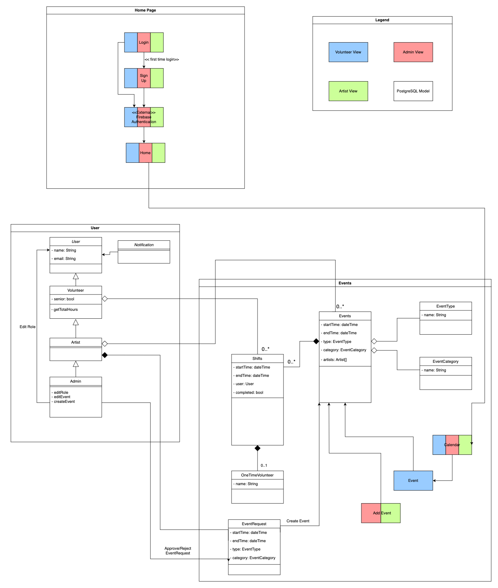
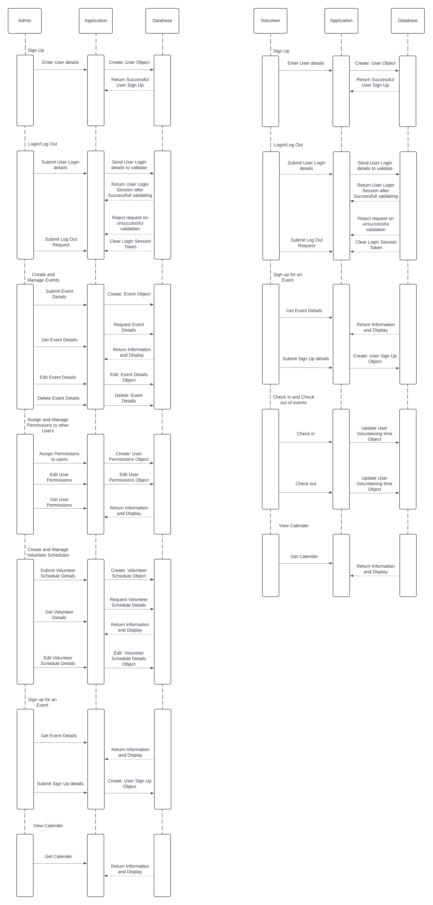
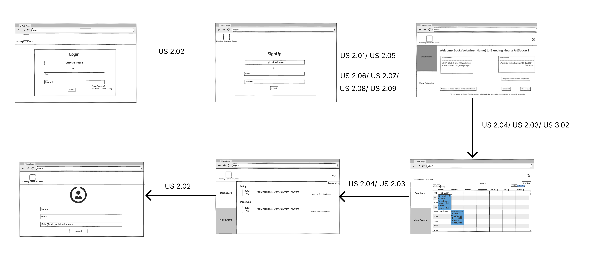
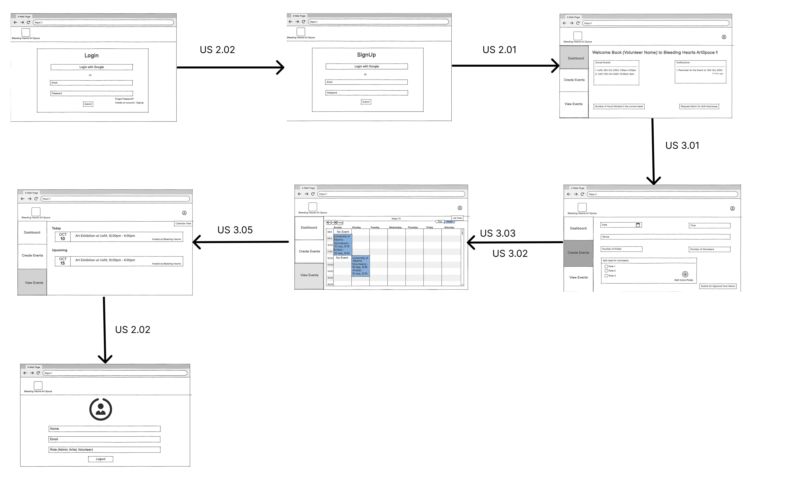

# Software Design

This page includes a short description of the overall architecture style of the system, its high-level system components, and their logical (what data they exchange) and control (how they invoke each other) dependencies.

## Architecture Diagram

The application uses a React frontend that communicates with an Express.js backend via a JSON REST 
API. The Express.js backend utilizes Kysely SQL builder to communicate with PostgreSQL for data 
management. The backend also uses Firebase Authentication for user authentication, and SendGrid 
for email functionality.

## UML Class Diagram

The system revolves around Events, which contain Shifts. Users are the core entity, with specialized classes like Volunteer, Artist, and Admin inheriting from the base User class. Volunteers can sign up for Shifts, while Artists have additional capabilities, including the ability to request Events. Admins possess all permissions of Artists and can also manage user roles. This hierarchy represents a progressive increase in permissions and capabilities from Volunteers to Artists to Admins, with each level inheriting the abilities of the previous one and gaining additional functionalities.

## Sequence Diagrams

This sequence diagram details the most important scenarios of how **Admins** and **Volunteers** interact with the system via the **Application** and **Database**:

- **Admin**: Signs up, logs in, creates and manages events, assigns user permissions, and manages volunteer schedules. These actions involve creating, editing, and retrieving objects like events, user permissions, and schedules, with data being passed between the application and database.
  
- **Volunteer**: Signs up, logs in, registers for events, checks in/out of events, and views their schedule. Volunteering time is tracked, and all interactions are handled by the application, which updates the database accordingly.

Both roles interact through the **Application**, which communicates with the **Database** to validate, store, and retrieve necessary data for user sessions, event management, and scheduling.

## Low-Fidelity User Interface

This is the overall look and feel of the web app.

### Admin UI

### Volunteer UI

### Artist UI

