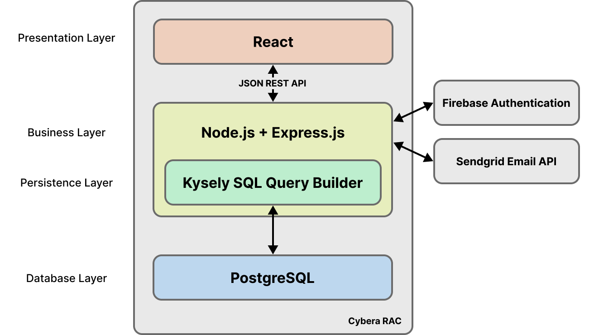

# Software Design

## Architecture Diagram
The application uses a React frontend that communicates with an Express.js backend via a JSON REST 
API. The Express.js backend utilizes Kysely SQL builder to communicate with PostgreSQL for data 
management. The backend also uses Firebase Authentication for user authentication, and SendGrid 
for email functionality.

