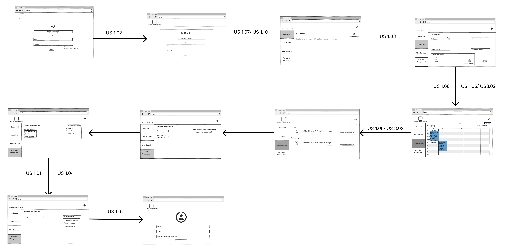

# Software Design

This page includes a short description of the overall architecture style of the system, its high-level system components, and their logical (what data they exchange) and control (how they invoke each other) dependencies.

## Architecture Diagram

The application uses a React frontend that communicates with an Express.js backend via a JSON REST 
API. The Express.js backend utilizes Kysely SQL builder to communicate with PostgreSQL for data 
management. The backend also uses Firebase Authentication for user authentication, and SendGrid 
for email functionality.

## UML Class Diagram

This is a short description of logical entities of the domain in a UML diagram.

[INSERT UML DIAGRAM HERE]

## Sequence Diagrams

Multiple sequence diagrams depicting the most important scenarios.

## Low-Fidelity User Interface

This is the overall look and feel of the web app.

### Admin UI

### Volunteer UI

### Artist UI

