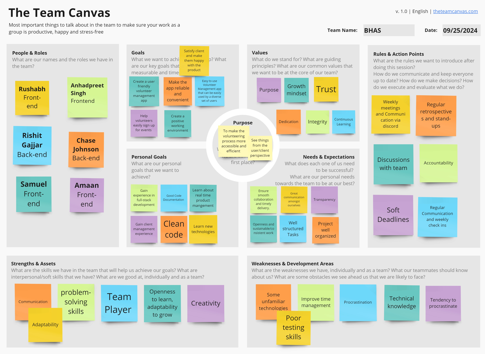

# Teamwork

This page provides an overview of the team and its members.

## Team Canvas

## Scrum Roles

#### Sprint 1:
- **Scrum Master** - Amaan Mohammed
- **Product Owner** - Chase Johnson

#### Sprint 2:
- **Scrum Master** - Amaan Mohammed
- **Product Owner** - Rishit Gajjar

#### Sprint 3:
- **Scrum Master** - Rushabh Shah
- **Product Owner** -  Amaan Mohammed

#### Sprint 4:
- **Scrum Master** - Rishit Gajjar
- **Product Owner** - Anhadpreet Singh

#### Sprint 5: 
- **Scrum Master** - Samuel Chan
- **Product Owner** - Chase Johnson

## Belbin Roles

Source: https://www.belbin.com/about/belbin-team-roles.

| Name             | Preferred Roles | Manageable Roles | Least Preferred Roles |
| ---------------- | --------------- | ---------------- | --------------------- |
| Amaan Mohammed   | RI, TW, IMP     | CF, CO, ME       | SP, PL, SH            |
| Anhadpreet Singh | CF, TW, RI      | IMP, SP, PL      | CO, ME, SH            |
| Chase Johnson    | TW, PL, CO      | IMP, RI, ME      | SP, SH, CF            |
| Rishit Gajjar    | IMP, CF, ME     | TW, SP, PL       | RI, CO, SH            |
| Rushabh Shah     | TW, CO, SP      | CF, PL, IMP      | RI, SH, ME            |
| Samuel Chan      | ME, CF, SP      | RI, CO, SH       | IMP, TW, PL           |

### Thinking Roles
#### PL (Plant): 
> Tends to be highly creative and good at solving problems in unconventional ways.

1. Chase Johnson (Preferred)
2. Anhadpreet Singh (Manageable)
3. Rishit Gajjar (Manageable)
4. Rushabh Shah (Manageable)

#### ME (Monitor Evaluator): 
> Provides a logical eye, making impartial judgements where required and weighs up the team's options in a dispassionate way.

1. Samuel Chan (Preferred)
2. Rishit Gajjar (Preferred)
3. Amaan Mohammed (Manageable)
4. Chase Johnson (Manageable)

#### SP (Specialist):
> Brings in-depth knowledge of a key area to the team.

1. Rushabh Shah (Preferred)
2. Samuel Chan (Preferred)
3. Anhadpreet Singh (Manageable)
4. Rishit Gajjar (Manageable)

### Action Roles:
#### SH (Shaper): 
> Provides the necessary drive to ensure that the team keeps moving and does not lose focus or momentum.

1. Samuel Chan (Manageable)

#### IMP (Implementer): 
> Needed to plan a workable strategy and carry it out as efficiently as possible.

1. Amaan Mohammed (Preferred)
2. Rishit Gajjar (Preferred)
3. Anhadpreet Singh (Manageable)
4. Chase Johnson (Manageable)
5. Rushabh Shah (Manageable)

#### CF (Completer Finisher): 
> Most effectively used at the end of tasks to polish and scrutinize the work for errors, subjecting it to the highest standards of quality control.

1. Samuel Chan (Preferred)
2. Anhadpreet Singh (Preferred)
3. Rishit Gajjar (Preferred)
4. Amaan Mohammed (Manageable)
5. Rushabh Shah (Manageable)

### People Roles:
#### RI (Resource Investigator): 
> Uses their inquisitive nature to find ideas to bring back to the team.

1. Samuel Chan (Manageable)
2. Amaan Mohammed (Preferred)
3. Anhadpreet Singh (Preferred)
4. Chase Johnson (Manageable)

#### TW (Teamworker): 
> Helps the team to gel, using their versatility to identify the work required and complete it on behalf of the team.

1. Rushabh Shah (Preferred)
2. Amaan Mohammed (Preferred)
3. Chase Johnson (Preferred)
4. Rishit Gajjar (Manageable)

#### CO (Co-ordinator): 
> Needed to focus on the team's objectives, draw out team members and delegate work appropriately.

1. Rushabh Shah (Preferred)
2. Samuel Chan (Manageable)
3. Chase Johnson (Preferred)
4. Amaan Mohammed (Manageable)
